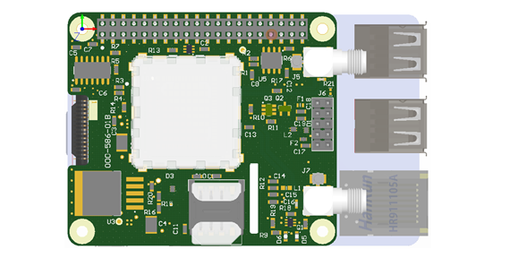

{::nomarkdown}
<!DOCTYPE html>
<html>
  

<head>
<meta name="viewport" content="width=device-width, initial-scale=1">
<link rel="stylesheet" href="https://cdnjs.cloudflare.com/ajax/libs/font-awesome/4.7.0/css/font-awesome.min.css">

</head>
<body>

  <a href="#home">Home</a>
  <a href="#news">News</a>
  

    <button class="dropbtn"><a href="https://izzybobs.github.io/pilot/networkManagerDocs/">Network Manager Documentation</a>
      <i class="fa fa-caret-down"></i>
    </button>
    

      <a href="#">Link 1</a>
      <a href="#">Link 2</a>
      <a href="#">Link 3</a>
    

  
 

</body>
{:/}
---
The PiloT is a Raspberry Pi \(RPi\) HAT compliant board which provides cellular
 connectivity, some variants also have GNSS location capability. test

The PiloT power state is controlled via the Rpi GPIO and the Pilot is powered
 via the RPi 40 pin header.

Control and data communications between the PiloT with the RPi is via USB or
 the RPi physical serial port. Note that some RPi variants use the physical serial port to communicate with the RPi on board WiFi / Bluetooth systems 

## Technical information links

Click [Network manager documentation](./networkManagerDocs/README.md) for
 information on an alternative method of automating PiloT cellular IP
  connectivity. Network manager also provide an developers with API's for 
  networking control, cellular SMS and general radio information   
  
Click [Shell Scripts](./scripts_pilotControl/) for example scripts that
 power up and down the PiloT HAT

Click [IP link check automation](./scripts_python_checkIp/README.md) for a demo
 project which adds IP ping link checking to the RPi
 
Click [Speed tests](./speedtests/README.md) for records of practical
 network speed testing

## Compatibility

Raspberry Pi 4 Model B
Raspberry Pi 3 Model B+
Raspberry Pi 3 Model B
Raspberry Pi 2 Model B
Raspberry Pi Zero W
Raspberry Pi Zero

